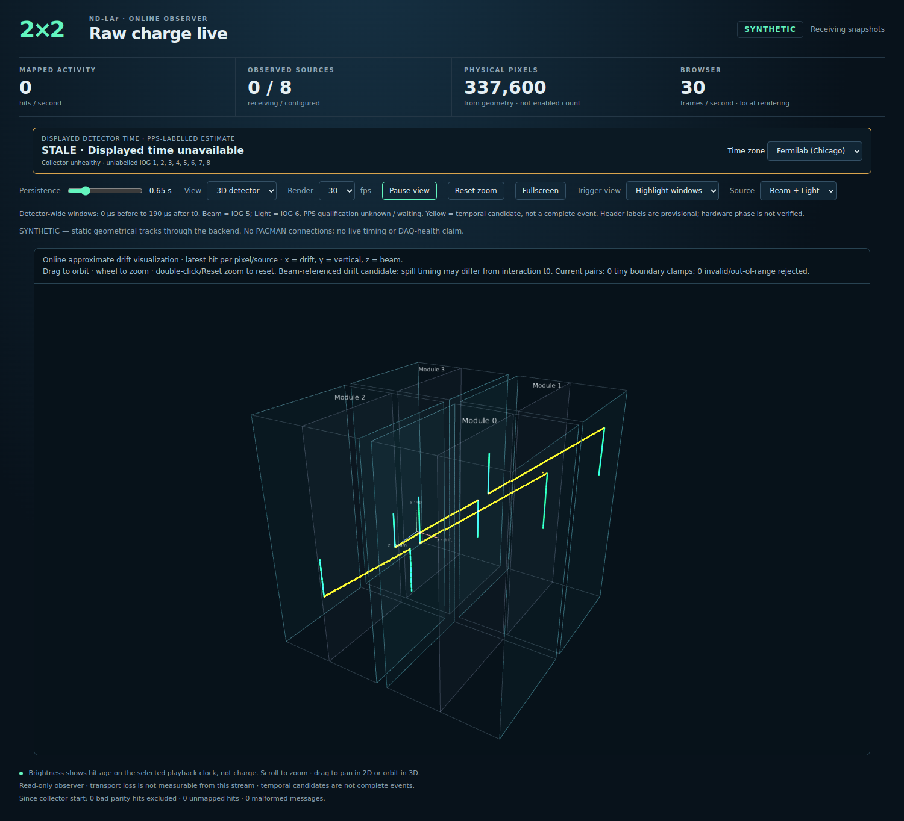

# 3D development validation — 2026-10-07

This records offline implementation evidence on `feature/3d-events` from
accepted v1.0.0 commit `cd4f5632fe42e05ab41cb9bd5202f1fde3c5228a`.
No live PACMAN, DAQ or PacMon connection was made. No current Run-3 Flow file
was supplied. These results do not constitute live commissioning acceptance.

## Baseline and final regression results

The untouched v1 baseline's complete `pytest -q` was attempted first. libzmq
aborted inside `ip_resolver.cpp:542` with `Operation not permitted` during a
local PUB/SUB integration test. Repeating tests while deselecting the seven
real-ZMQ cases produced **220 passed, 1 failed, 3 skipped, 7 deselected**.
The failure was an existing Node assertion requiring the WebSocket URL to
*end* in `&sync83=1`, although v1 already appended trigger parameters. The
assertion now checks that the same parameter is present; runtime connection
behavior was not changed to satisfy it.

The final available suite, with all four optional browser fixtures and the
Flow comparator enabled, produced **254 passed, 7 deselected in 33.79 s**.
One upstream Starlette/httpx deprecation warning was emitted. No tests were
skipped in this run. Python 3.12.14, NumPy 2.5.3, Node 24.19.0 and headless
Chromium 133.0.6943.0 with SwiftShader were used.

```bash
RAW_DISPLAY_BROWSER_TEST=1 \
RAW_DISPLAY_OFFLINE_BROWSER_TEST=1 \
RAW_DISPLAY_CLOCK_BROWSER_TEST=1 \
RAW_DISPLAY_3D_BROWSER_TEST=1 \
RAW_DISPLAY_FLOW_ROOT=/path/to/pinned/ndlar_flow \
CHROMIUM_EXECUTABLE=/path/to/chromium \
python -m pytest -q -ra -k \
  'not eight_real_local_subscriptions and not real_local_zmq and not local_zmq and not local_collector'
```

The environment-blocked cases are:

* `test_detector_protocol.py::test_eight_real_local_subscriptions_and_both_source_layers`
* `test_display.py::test_real_local_zmq_ingest_and_malformed`
* `test_post_sync.py::test_local_collector_cut_and_heartbeat_isolation` (both parameters)
* `test_rate_audit.py::test_local_zmq_collector_publishes_exact_rate_rows`
* `test_timing.py::test_local_zmq_timed_collector`
* `test_trigger_audit.py::test_real_local_collector_unexpected_source_preserves_audit`

Run the **complete suite without deselection** on the deployment/development
host where local ZMQ is available. The HTTP/WebSocket tests did run here,
including the existing real-loopback browser fixture; the limitation is the
native ZMQ interface lookup, not an application test waiver.

A wheel built successfully with `pip wheel --no-deps .`. Inspection verified
byte-for-byte inclusion of the binary/JSON geometry, renderer, decoder,
Three.js, OrbitControls and upstream license. Runtime dependencies contain no
Flow, h5flow, YAML, SciPy, Node service or new reconstruction framework.

## Geometry and reference checks

The generator uses actual pinned Flow resource code and independently checks
the module-specific YAML transforms. It verified **337,600 physical pixels**,
**1,350,400 Hydra electronics aliases**, all eight IOGs, both drift signs,
common anodes, module bounds and full drift to cathodes. The packaged artifact
contains 192 reference samples spanning every physical tile and input hashes.
Tests verify raw pixel identity, source hashes, selected-IOG remapping, corrupt
artifact rejection and finite coordinates. Numerical choices and provenance
are detailed in [the geometry guide](3d_display.md#authoritative-geometry-and-numerical-choices).

Reconstruction tests cover dt = 0, 10, 100, 189.9 and 190.6 us, both signs and
all eight IOGs. Tiny excess at the physical boundary clamps with a diagnostic;
negative/large drift is rejected. Normal 190 us candidates stay inside the
304.31 mm geometry limit.

`test_flow_comparison.py` writes an explicitly **synthetic** Flow-schema HDF5
fixture using the pinned Flow resource's own lookup tables and coordinates.
It checks 768 electronics aliases, forward/reverse packet references,
unsorted rows, bounded sampling and a deliberately introduced 1 mm mismatch.
This verifies the comparator, not agreement with real Run-3 data. Run
`tools/compare_flow_geometry3d.py` on a representative current file before
commissioning; no arbitrary coordinate or timing offsets should be fitted.

## Pairing and transport

Tests cover the exact half-open 190 us endpoints, Beam/Light/both, overlapping
windows, latest preceding t0, repeated pixels, late-trigger reassociation,
different local epoch numbers, PPS rollover, stale/unqualified timing,
pre-window selection without a valid drift t0, queue capacity limits, pair
clearing and feature-off state allocation.

Protocol tests check coherent shared snapshots, old string acknowledgements,
dynamic opt-in over the same WebSocket, full resnapshot after re-enabling,
t0-only changes, explicit clearing, disabled geometry endpoints and optional
encoding failure isolation. Browser decoding validates a whole frame before
mutating pairs and rejects unsafe integer/invalid payloads without closing
the canonical 2D stream. Pause retains pairs across reconnects.

## Geometrical track through backend and WebGL

The fixture chooses known physical line points in both z halves of the
detector, maps to physical pixels and derives integer drift times from x.
Synthetic wire words then pass through the actual decoder, raw geometry LUT,
ASIC unroller/playback, PPS alignment, trigger router, observer publication
and R3D1 encoding. Different local IOG origins exercise epoch translation.
There are **437 unique points across all four modules/eight TPCs**.

The WebGL fixture uses the real frontend and full packaged geometry, with
the backend-produced snapshots delivered through a controlled browser
transport. Both source clouds reproduce the target coordinates with maximum
absolute x error **0.0790764491 mm**, within half a 100 ns tick's nominal drift
distance (about 0.079823 mm); y/z match the mapped physical pixels.

It also exercises all/highlight/window-only modes, Beam/Light/both, camera
orbit/reset, pause with a t0-only update, resume, repeated 2D↔3D switches and
optional malformed-frame fallback. Existing Canvas and displayed-clock
browser fixtures passed independently. One WebSocket and one 3D geometry
fetch were observed; no external asset request occurred. The 3D fixture's
WebSocket is controlled; the existing 2D fixture separately checks the real
loopback HTTP/WebSocket server.



The preview is deliberately labelled SYNTHETIC. Its unavailable live clock
and 0/8 receiving sources are truthful; it does not fabricate DAQ health.

## Performance evidence and its limits

The CPU fixture replays 2,490,368 generated hits in four simulated seconds
(622,592 hits/s), eight-word messages, drain cap 256, 2 Hz Beam and 20 Hz Light.
Three repetitions preserve identical ordinary hit state; enabled modes each
match 7,200 hits and report no history/pending-buffer drops.

| Synthetic collector-path mode | Median CPU core equivalent at fixture rate | Range |
|---|---:|---:|
| Trigger matching off | 0.215 | 0.168–0.225 |
| Ordinary 2D trigger matching | 0.265 | 0.243–0.276 |
| 3D paired trigger matching | 0.271 | 0.263–0.293 |

The fixture uses 512 logical pixels and exercises decode/timing/routing; it
excludes live geometry lookup, ZMQ, shared publication and web rendering.
These are CPU-path measurements, not measured production collector CPU.
Separate fresh-process runs measured 63.61 MiB peak RSS for the 2D fixture and
63.93 MiB for paired 3D. These include Python and fixture inputs and are **not
full-geometry collector RSS**. At 337,600 pixels, each additional two-source
int64 dt allocation is exactly 5,401,600 bytes (5.15 MiB), with separate copies
in collector, shared memory and server snapshot plus bounded pending data.

The full-geometry headless browser sample reported 27 FPS while 2D was
selected and 30 FPS in 3D at the requested 30 FPS cap. These short software-GPU
samples are not an ops01 performance guarantee. While 2D was selected it
received **zero R3D1 frames/bytes**. The controlled 3D workload sends repeated
full 874-pair snapshots: 20,988 payload bytes/frame, or 209,880 bytes/s at
10 Hz, before WebSocket framing. It received 272,844 bytes across 13 such
frames in the recorded sample. This is a fixture payload rate, not live
bandwidth; the real server sends changed pairs and at least a 12-byte header.

Raw records: [CPU benchmark](validation/3d_2026-10-07/benchmark.json),
[fresh-process RSS samples](validation/3d_2026-10-07/memory.json),
[browser/track metrics](validation/3d_2026-10-07/browser.json).
Reproduce CPU tests with:

```bash
python tools/benchmark_detector_triggers.py --seconds 4 --repeats 3 --include-3d
```

## Still required on the existing live instance

Follow [the commissioning runbook](3d_display.md#commissioning-on-the-existing-instance).
Run one collector only and record the following before accepting live 3D:

1. Full tests with real local ZMQ and representative Run-3 Flow comparison.
2. Gate-off 2D behavior, subscriber count, 8/8 PPS alignment and normal IOG
   timing, including the repaired IOG6 behavior.
3. Collector CPU/RSS, browser FPS, WebSocket byte deltas and DAQ/PacMon health
   for gate off, gate on with 2D selected, then 3D selected at comparable rates.
4. A real Light-triggered cosmic: correct anodes, inward drift on both sides,
   no mirror/axis swap and no cathode overshoot. Exercise Beam/Light controls,
   persistence, pause, fullscreen and view switching.

No live deployment, release/tag change or operational acceptance is claimed.
